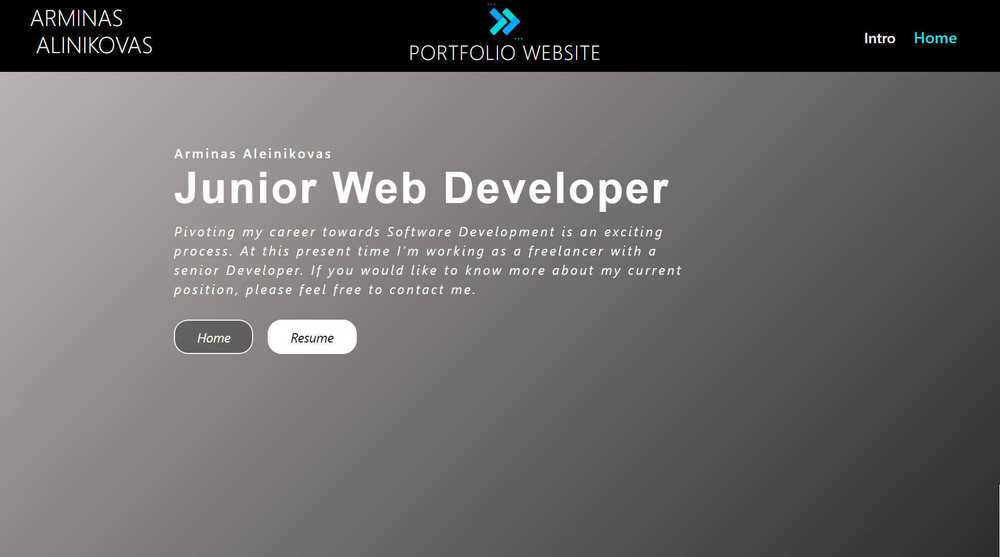
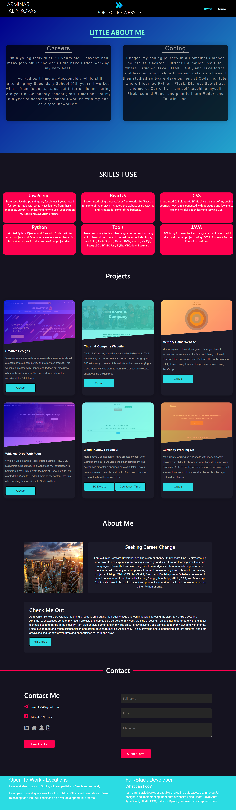

# Arminas Portfolio
* In building my portfolio, I utilized a variety of tools and programming languages, including React for building user interfaces, JavaScript and TypeScript for implementing logic and functionality, HTML and CSS for structuring and styling my website, Bootstrap for responsive design and grid layout, and Firebase for hosting and database management

## About This Portfolio
* This website is fully responsive and designed with a mobile-first approach. I created this website to showcase some of my skills and to feature my previous projects that I have created. You can find a wide range of projects on my portfolio, including web development, graphic design, and terminal projects. I put a lot of effort and time into creating a user-friendly and visually appealing design that is easy to navigate. If you're interested in learning more about me and my work, I would love for you to check out my website by clicking on the link provided [Arminas Portfolio](https://portfolio-react-f4905.firebaseapp.com/). Feel free to reach out to me if you have any questions or if you're interested in working together on a project.

### Protfolio Image (Intro To My Portflio)

### Image Of My Home Page In Portfolio

